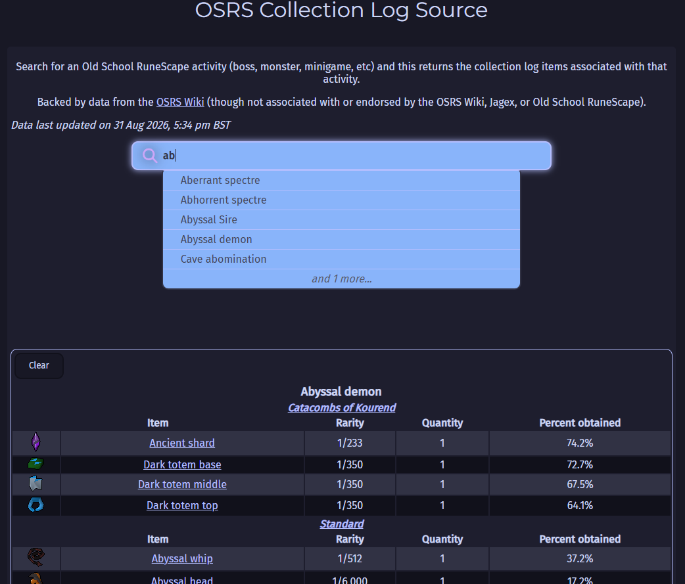

# osrs-clog-source

Website & OSRS Wiki scraper for Collection Log sources. All written by hand as personal project.

## Scraper

The scraper is a Go tool responsible for fetching & formatting the relevant details from the OSRS wiki. See the scraper's [README.md](./scraper/README.md) for more info.

## Website

The website allows for exploring the data, sorted by source. Not yet hosted anywhere, planning to do that soon. It is written in just raw HTML, CSS, and vanilla JavaScript with no frameworks.

The data from the scraper is stored in local storage and re-fetched any time the hash has changed, to save fetching the ~1MB every time.

Because just about everything is done locally and there are no dependencies to load, it is pretty lightning fast.

The load from the webpage to the Wiki is limited to just the image icons.

### Website TODOs

* arrow keys / enter to navigate the dropdown
* allow user to sort by different columns
* minify CSS/JS? Probably not worth the hassle currently given there is a tiny amount in total

## Workflow

The scraper runs in a Github Actions workflow (currently kicked off manually, intended to run once a week after game updates automatically). This collects the relevent details into the relevant format, and uploads them as JSON to the S3 bucket that the website is served from, as well as a file containing the hash of the JSON file.

When the webpage is loaded for the first time, it puts the scraped JSON file into local storage. Whenever it detects that the hash has changed, then it re-fetches the JSON file.
